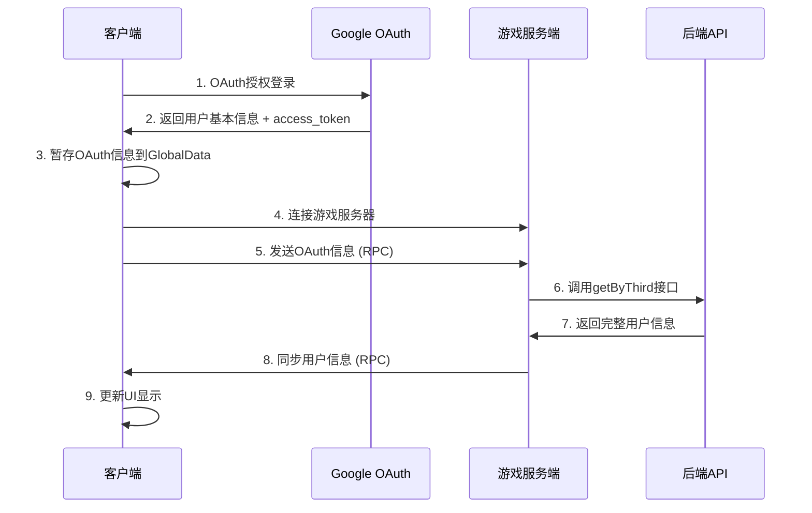

# 🏗️ 服务端OAuth架构 - 解决跨域问题

## 🎯 架构目标

解决客户端直接调用 `getByThird` 接口的跨域问题，改为：
1. **客户端**: OAuth登录 + 暂存token
2. **服务端**: 接收OAuth信息 + 调用getByThird + 返回用户信息
3. **客户端**: 接收并显示完整用户信息

## 🔄 完整流程



## 🏛️ 架构组件

### 1. 客户端 OAuth 处理 (`login_button.gd`)

#### 修改前（有跨域问题）:
```gdscript
func _on_token_authorized():
    var user_info_dict = oauth_manager.get_user_info_dict()
    # ❌ 客户端直接调用，Web平台有跨域问题
    var result = await Request._http_post(THRID_URL, JSON.stringify(params), headers)
    GlobalData.user_info = result.data
```

#### 修改后（无跨域问题）:
```gdscript
func _on_token_authorized():
    var user_info_dict = oauth_manager.get_user_info_dict()
    
    # ✅ 暂存OAuth信息，等待服务端处理
    var oauth_info = {
        "source": "google",
        "third_id": user_info_dict.sub,
        "origin_data": user_info_dict,
        "access_token": oauth_manager.get_access_token()
    }
    GlobalData.oauth_info = oauth_info
    
    # ✅ 使用临时用户信息，标记为待验证
    var temp_user_info = {
        "name": user_info_dict.get("name", ""),
        "email": user_info_dict.get("email", ""),
        "picture": user_info_dict.get("picture", ""),
        "third_id": user_info_dict.sub,
        "oauth_pending": true  # 标记为待服务端验证
    }
    GlobalData.user_info = temp_user_info
```

### 2. 全局数据管理 (`global_data.gd`)

```gdscript
extends Node

@export var user_info: Variant = null
@export var oauth_info: Variant = null  # 新增：OAuth临时存储
```

### 3. 服务端处理逻辑 (`main.gd`)

#### 客户端连接时自动同步
```gdscript
@rpc("any_peer", "call_local", "reliable")
func peer_ready():
    var client_id = multiplayer.get_remote_sender_id()
    if client_id != 1:
        multiplayer_spawner.spawn({ "client_id": client_id })
        # ✅ 自动发送OAuth信息给服务端
        if GlobalData.oauth_info != null:
            sync_oauth_to_server.rpc_id(1, GlobalData.oauth_info)
```

#### 服务端OAuth处理
```gdscript
@rpc("any_peer", "call_remote", "reliable")
func sync_oauth_to_server(oauth_info: Dictionary):
    if multiplayer.is_server():
        var client_id = multiplayer.get_remote_sender_id()
        await process_oauth_and_get_user_info(client_id, oauth_info)

func process_oauth_and_get_user_info(client_id: int, oauth_info: Dictionary):
    # ✅ 服务端调用getByThird，无跨域问题
    var result = await Request._http_post(
        "https://backend-pro-qavdnvfe5a-uc.a.run.app/open/user/getByThird",
        JSON.stringify(params),
        headers
    )
    
    if result and result.has("data"):
        # ✅ 返回完整用户信息给客户端
        sync_user_info_to_client.rpc_id(client_id, result.data)
```

#### 客户端接收用户信息
```gdscript
@rpc("authority", "call_remote", "reliable")
func sync_user_info_to_client(user_info: Dictionary):
    # ✅ 更新为完整的用户信息
    GlobalData.user_info = user_info
    GlobalData.oauth_info = null  # 清除临时OAuth信息
    
    # ✅ 通知UI更新
    get_tree().call_group("login_buttons", "update_user_display", user_info)
```

## 🔧 技术优势

### ✅ 解决的问题
1. **跨域问题** - 客户端不再直接调用后端API
2. **安全性** - OAuth token在服务端处理，更安全
3. **可靠性** - 服务端网络环境更稳定
4. **集中管理** - 所有API调用统一在服务端

### ✅ 保持的功能
1. **Web平台支持** - JavaScript OAuth方案仍然可用
2. **桌面平台支持** - 原有OAuth流程不变
3. **自动化流程** - 连接服务器时自动同步
4. **错误处理** - 完整的错误反馈机制

## 🎮 使用场景

### 场景1: Web平台用户
```
1. 用户在Web浏览器中打开游戏
2. 点击登录，自动跳转Google OAuth
3. 授权成功，显示临时用户名
4. 连接游戏服务器，自动获取完整用户信息
5. 显示头像、等级等详细信息
```

### 场景2: 桌面平台用户
```
1. 用户启动桌面客户端
2. 点击登录，OAuth授权流程
3. 授权成功，显示临时用户名
4. 连接游戏服务器，自动获取完整用户信息
5. 显示头像、等级等详细信息
```

## 📊 数据流向

### OAuth信息结构
```gdscript
{
    "source": "google",
    "third_id": "google_user_id",
    "origin_data": {
        "sub": "google_user_id",
        "name": "用户名",
        "email": "email@example.com",
        "picture": "头像URL"
    },
    "access_token": "ya29.a0Aa..."
}
```

### 临时用户信息结构
```gdscript
{
    "name": "用户名",
    "email": "email@example.com", 
    "picture": "头像URL",
    "third_id": "google_user_id",
    "oauth_pending": true  # 标记为待验证
}
```

### 完整用户信息结构（来自getByThird）
```gdscript
{
    "uid": "rpggo_user_id",
    "name": "用户名",
    "email": "email@example.com",
    "texture": "游戏头像URL",
    "level": 25,
    "exp": 1500,
    "coins": 10000,
    # ... 更多游戏数据
}
```

## 🔄 状态管理

### 用户状态流转
```
1. 未登录 → OAuth授权 → 临时登录(oauth_pending=true)
2. 临时登录 → 连接服务器 → 完整登录(oauth_pending=false)
3. 完整登录 → 断开连接 → 重连时自动同步
```

### 错误处理
```gdscript
# 服务端获取用户信息失败
@rpc("authority", "call_remote", "reliable") 
func sync_user_info_error(error_message: String):
    print("服务端用户信息获取失败: ", error_message)
    # 可以显示错误提示，回退到临时用户信息
```

## 🧪 测试流程

### 1. 本地测试
```bash
# 启动服务端
- 运行游戏，选择"Create Server"
- 观察服务端日志

# 启动客户端
- 运行另一个游戏实例，选择"Connect to Server"
- 进行OAuth登录
- 观察OAuth同步日志
```

### 2. 预期日志输出

#### 客户端日志
```
OAuth授权成功，用户信息: {name: "John", email: "john@example.com", ...}
OAuth信息已暂存，等待连接服务器时同步
客户端连接成功，发送OAuth信息给服务端
客户端收到服务端的用户信息: {uid: "12345", name: "John", ...}
更新登录按钮显示，新的用户信息: {uid: "12345", ...}
用户信息更新完成，来自服务端验证
```

#### 服务端日志
```
服务端收到客户端 2 的OAuth信息
OAuth信息: {source: "google", third_id: "google_123", ...}
服务端开始处理OAuth，客户端ID: 2
服务端获取用户信息成功: {uid: "12345", name: "John", ...}
```

## 🚀 部署考虑

### 生产环境
1. **服务端API访问** - 确保游戏服务器能访问后端API
2. **网络安全** - 服务端到后端的通信加密
3. **负载均衡** - 多服务器实例的OAuth信息同步
4. **错误恢复** - 服务端API调用失败的重试机制

### 性能优化
1. **缓存机制** - 服务端缓存用户信息，避免重复调用
2. **批量处理** - 多个客户端的OAuth请求批量处理
3. **异步处理** - 用户信息获取不阻塞游戏逻辑

## 📋 总结

这个新架构完全解决了Web平台的跨域问题，同时保持了：
- ✅ **完整功能** - 所有OAuth功能都正常工作
- ✅ **跨平台** - Web和桌面平台都支持
- ✅ **自动化** - 用户无需额外操作
- ✅ **安全性** - OAuth token在服务端处理
- ✅ **可扩展** - 易于添加新的第三方登录服务

现在可以安全地在Web平台部署，不会遇到跨域限制！🎉 